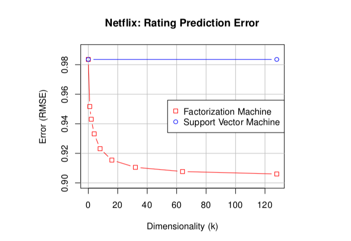
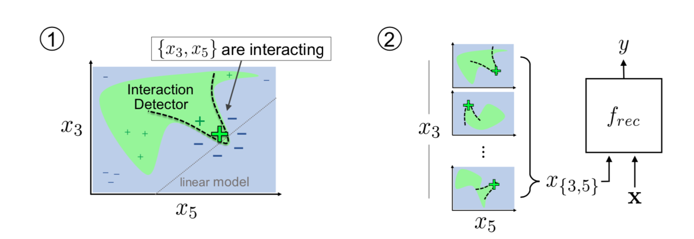

# Feature Interaction

## List

- [x] Predictive learning via rule ensembles
- [x] Detecting statistical interactions with additive groves of trees
- [x] Accurate intelligible models with pairwise interactions
Michael Tsang
- [x] NID：Detecting Statistical Interactions from Neural Network Weights
- [x] NIT：Neural Interaction Transparency (NIT): Disentangling Learned Interactions for Improved Interpretability
- [x] Feature Interaction Interpretability: A Case for Explaining Ad-Recommendation Systems via Neural Interaction Detection
- [x] Learning Global Pairwise Interactions with Bayesian Neural Networks
FM相关
- [x] FM：Factorization machines
- [x] FFM：Field-aware Factorization Machines for CTR Prediction
- [x] DeepFM：DeepFM: A Factorization-Machine based Neural Network for CTR Prediction
- [x] xDeepFM：xDeepFM: Combining Explicit and Implicit Feature Interactions for Recommender Systems
- [x] Wide & Deep Learning for Recommender Systems
- [x] Deep & Cross：Deep & Cross Network for Ad Click Predictions
- [x] AFM：Attentional Factorization Machines: Learning the Weight of Feature Interactions via Attention Networks
- [x] DIN：Deep Interest Network for Click-Through Rate Prediction
- [x] AutoInt: Automatic feature interaction learning via self-attentive neural networks

## Predictive learning via rule ensembles

> ensemble: rules + linear (robust), penalized, rule by trees (correlated predictor control by edge w/ incentive).
>
> Loss Function: regression and classification
>
> Importance: of a rule and of a predictor.

Interaction: Partial dependence and statistic. Bootstrap to generate a reference distribution.

> $F_{s}\left(\mathbf{x}_{s}\right)=E_{\mathbf{x}_{\backslash s}}\left[F\left(\mathbf{x}_{s}, \mathbf{x}_{\backslash s}\right)\right]$
>
> $H_{j k}^{2}=\sum_{i=1}^{N}\left[\hat{F}_{j k}\left(x_{i j}, x_{i k}\right)-\hat{F}_{j}\left(x_{i j}\right)-\hat{F}_{k}\left(x_{i k}\right)\right]^{2} / \sum_{i=1}^{N} \hat{F}_{j k}^{2}\left(x_{i j}, x_{i k}\right)$
>
> $H_{j}^{2}=\sum_{i=1}^{N}\left[F\left(\mathbf{x}_{i}\right)-\hat{F}_{j}\left(x_{i j}\right)-\hat{F}_{\backslash j}\left(\mathbf{x}_{i \backslash j}\right)\right]^{2} / \sum_{i=1}^{N} F^{2}\left(\mathbf{x}_{i}\right)$
>
> $\begin{aligned} H_{j k l}^{2}=\sum_{i=1}^{N}\left[\hat{F}_{j k l}\left(x_{i j}, x_{i k}, x_{i l}\right)-\hat{F}_{j k}\left(x_{i j}, x_{i k}\right)\right.& \\-\hat{F}_{j l}\left(x_{i j}, x_{i l}\right)-\hat{F}_{k l}\left(x_{i k}, x_{i l}\right)+\hat{F}_{j}\left(x_{i j}\right) & \\\left.+\hat{F}_{k}\left(x_{i k}\right)+\hat{F}_{l}\left(x_{i l}\right)\right]^{2} / \sum_{i=1}^{N} \hat{F}_{j k l}^{2}\left(x_{i j}, x_{i k}, x_{i l}\right) \end{aligned}$

## **Accurate Intelligible Models with Pairwise Interactions**

### GA$^2$M

Greedy, Fisrst fit GAM residual with a subset of pairs $\mathcal S$, then fit the new residual $R$ respectively with each remaining pair, add the best fit pair to $\mathcal S$, and iterate.

### FastInteractionDetection

**FAST**: given bins, first compute histogram and cumulative histogram on target and weight to form a lookup table, then reuse them to calculate sum of target on 4 quadrants for each cut. RSS is easily calculable for bin fctns.

## Detecting statistical interactions with additive groves of trees

$F^*(x)$: Target function

$F(x)$: Highly accurate model

$R_{ij}(x)$: Highly accurate but ban interaction between $x_i$ and $x_j$

RMSE normalized by std: $\begin{array}{c}\operatorname{stRMSE}(F(\mathbf{x}))=\frac{\operatorname{RMSE}(F(\mathbf{x}))}{\operatorname{StD}\left(F^{*}(\mathbf{x})\right)} \\ I_{i j}(F(\mathbf{x}))=\operatorname{stRMSE}(F(\mathbf{x}))-\operatorname{stRMSE}\left(R_{i j}(\mathbf{x})\right)\end{array}$

Significant: $I_{i j}(F(\mathbf{x}))>3 \cdot \operatorname{StD}(\operatorname{stRMSE}(F(\mathbf{x})))$

std from bagging, etc.

1. Highly predictive for interactions — *captures interaction*
2. Highly predictive when restricted by non-interaction pair — *lest pseudo interaction*

Additive Groove of regression trees

**Correlation**: drop features (backward elimination)

1. not hurt performance
2. each var is important and removal drops the performance

max detection of interaction <= performance drop removing one of the variables in the pair

### Comparison with *Predictive learning via rule ensembles*

> the calculation of $H_{ij}^2$ method can be hurt by spurious interaction for sparse regions of datapoint. did not understand what this means. but lets just say it this is better at preventing such situations.
>
> **Did not understand this**

#### Difference

1. $F(\mathbf{x})=\hat{a}_{0}+\sum_{k=1}^{K} \hat{a}_{k} r_{k}(\mathbf{x})+\sum_{j=1}^{n} \hat{b}_{j} l_{j}\left(x_{j}\right)$ a regularized regression
2. $F(x)=\sum_{i=1}^KT_i(x)$, optimize RMSE, and limit tree size.

#### Pro

~~Statistic: less computation, no need to estimate expectation five times.~~ (But does need to compute RMSE and std.)

Statistic: lest spurious local interactions.

Better than GA2M in that high order interaction is included

#### Con

Model: Hard to capture linear response with tree structure.

~~without weight could overfit? Bagging solves this.~~ 

 **would all the trees in the restriction procedure lean to one relatively more important variable in the pair?** need we add some penalty or (random) incentive?

### Summary

* defines an intereaction statistic by complete model and interaction-free model. significant if greater than 3*std, std generated by resampling. need to remove correlated.

* uses an additive tree model with a 3-layer algm bagging-growing-backfitting

* restrict an inteaction-free tree groove model by forbidding one of the variables each time and selecting the best for each tree generation. 

  > **Que: why this prevents just using the more important var comparing to a ban-same-brance procedure?**

* beats the *Predictive learning via rule ensembles* statistic in avoiding spurious interaction at sparse regions.

## NID：Detecting Statistical Interactions from Neural Network Weights

### Literature on interaction

1. individual tests on each subset of variables: ANOVA, Grooves, GA2M FAST, etc.
2. prespecify form, then lasso: $O(p^2)$

### Interaction strength

> use $\mu(|\mathbf w_{\mathcal I}|)$ as interaction strength of interaction $\mathcal I$
>
> 1) interaction strength is evaluated as zero whenever an interaction does not exist (one of the features has zero weight); 2) interaction strength does not decrease with any increase in magnitude of feature weights; 3) interac- tion strength is less sensitive to changes in large feature weights.
>
> influence of vertex$\mathbf{z}^{(\ell)}=\left|\mathbf{w}^{y}\right|^{\top}\left|\mathbf{W}^{(L)}\right| \cdot\left|\mathbf{W}^{(L-1)}\right| \ldots\left|\mathbf{W}^{(\ell+1)}\right|$

$\omega_{i}(\mathcal{I})=z_{i}^{(1)} \mu\left(\left|\mathbf{W}_{i, \mathcal{I}}^{(1)}\right|\right)$

### Interaction detection: NID

1) train a feedforward network with regularization (group lasso), 2) interpret learned weights to obtain a ranking of interaction candidates, and 3) determine a cutoff for the top-K interactions.

Neuron network: MLP, MLP-M. sparsity regularization

**Higher order true interaction beats its redundant ones, leading to "essential/base" interaction detection**

GAM plateu validation

### Pro

1. reduced computation **?** : needless to enumerate all possible interactions
2. detacts the maximum order interaction and automatically prunes the redundant low-order ones. $x_1x_2x_3$ **At what cost of complexity? is it worth to calculate high orders?** 
3. AUC better than RuleFit and AG for 2nd-order detection
4. Neuron networks can handle all forms of functions in comparison tree models

### Con

1. need to train a neuron network first and multiply the weights
2. spurious high-order interaction detection for $x_1x_2+x_2x_3+x_1x_3$
3. ~~Correlation~~

### Complexity

### Summary

Consider how a neuron network captures interaction. 1) common node (large weight) in the first hidden layer. 2) the node passes to the result (product of weight matrices) 1) and 2) leads to a measure of interaction of all orders.

Train a neuron net, then use a greedy algrithm to rank potential interaction of all orders, then find a cutoff on a vaidation set, adding the interaction terms to a GAM until performance plateaus out.

>Pros and cons of the models:
>GA2M FAST:
>Pro: fast
>Con: 
>
>1. binary bins can’t capture complex interactions
>2. accuracy drops for high dimensional data
>
>Additive Grooves (vs RuleFit):
>Pro: 
>1. statistic: lest spurious local interactions.
>2. high order interaction is included
>Con:
>1. model: Hard to capture linear response with tree structure, in comparison with RuleFit
>2. **would all the trees in the restriction procedure lean to one relatively more important variable in the pair?** need we add some penalty or (random) incentive?
>
>NID:
>Pro
>1. reduced computation ? : needless to enumerate all possible interactions
>2. detects the maximum order interaction and automatically prunes the redundant low-order ones. 
>**At what cost of complexity? is it worth to calculate high orders?** 
>3. AUC better than RuleFit and AG for 2nd-order detection
>4. Neuron networks can handle all forms of functions in comparison tree models
>Con
>1. need to train a neuron network first and multiply the weights
>2. spurious high-order interaction detection for
>
>Known models of Interaction detection:
>1.    ANOVA
>2.    Explicit models of interaction: GA2M, FAST, Lasso-based, etc.
>3.    compute statistic with tree-based ensemble models: RuleFit, AG
>4.    Weights of Neuron Network 
>

## NIT：Neural Interaction Transparency (NIT): Disentangling Learned Interactions for Improved Interpretability

Entangled Interaction: spuriously high order 	$x_1x_2+x_3x_4\to {x_1,x_2,x_3,x_4}$ instead of ${x_1,x_2}$ and ${x_3,x_4}$

use smoothed $L_0$ regularization for a binary gate.

$\mathcal{R}_{\mathrm{NIT}}=\frac{1}{N}\left(\sum_{i=1}^{N} \mathcal{L}\left(f\left(\mathbf{x}_{i} ; \tilde{\mathbf{W}}^{(1)} \odot \mathcal{T}(\mathbf{G}(\mathbf{\Phi})),\left\{\mathbf{W}^{(\ell)}\right\}_{\ell=2}^{L+1},\left\{\mathbf{b}^{(\ell)}\right\}_{\ell=1}^{L+1}, y_{i}\right)\right)+\mathcal{L}_{\mathcal{K}}\right.$

$\mathcal{L}_{\mathcal{K}}=\max \left\{\left(\max _{i} \hat{k}_{i}\right)-K, 0\right\} \quad+\quad \lambda \frac{1}{\tilde{B}} \sum_{i=1}^{B} \hat{k}_{i}$

### Todo

Claims to be an O(1) model in that it does not exhaust the space of all possible interactions, but still needs to train a neuron network. **How fast it actually is? get the code and do trails in comparison with other methods**

### Summary

Neuron network with a gate on the weight matrix from the input to the first hidden layer that separates the decendent network into several disjoint sub-networks, yielding a GAM with interaction terms. The maximum order of interaction and each order of interation are penalized in regularization term.

## FM：Factorization machines

$\hat{y}(\mathbf{x}):=w_{0}+\sum_{i=1}^{n} w_{i} x_{i}+\sum_{i=1}^{n} \sum_{j=i+1}^{n}\left\langle\mathbf{v}_{i}, \mathbf{v}_{j}\right\rangle x_{i} x_{j}$

**only linear main effects and product interactions???**

Prediction: $O(k\cdot n)$, $O(k\overline m_D)$ if sparse.

solving parameters: gradient descent

 good prediction power on **sparse** data

### Problem on sparse data (usu. categorical):

Lack of values in certain nonzero combination of variables yielding underermined parameter of their interaction term. for models such as SVM (with interaction such as polynomial).

FM parameterizes such interaction terms by a dot product of two row vectors, thereby learns interaction omitted by SVM under sparse setting; while setting k<<n reduces complexity

but, is it so that this model captures the true target close enough? Especially with small k?

Theoretically, for example, for any solution in an order-2 FM model, there exists a solution in a quadratic SVM model identical to it, but not vise versa. The contradiction is: SVM has a larger solution space, but a  solution with good genralization tends to be unacquirable from sparse data, while FM has a smaller solution space, but the generalization is good? btw, the SVM solution is not unique for sparse data? e.g. gradient descent always gives a zero gradient since there is no all-non-zero data in the interaction variable subset, and solution to that parameter is the initial value set by the algorithm, usually zero.

but how generalizable is the FM model, especially for small k? in an extreme case, set k=1, then it is not good for high-rank interaction structures. see the following figure.

### Summary

FM uses a more restricted setting of parameteriation for interaction terms by dot product of rows of a matrix. This works well for hugely sparse categorical data (esp. w/ one-hot coding) in that it generalizes for interactions that did not show up in the dataset. It has linear complexity for computation $O(k\,n)$. 

In terms of interaction, it only considers $\prod_{i=1}^lx_{j_i}$, and only considers $x_i$ for main effect. This is complete for categorical data. ~~This is okay, since FM just covers categorical data for which the uncertainty of encoding makes further transformation senseless.~~

**embedding, parameter sharing.**

### Recapitulations on categorical interaction

In fact, $x_i$ and $x_ix_j$ and higher orders are sufficient to capture all the interactions, but pureness is not attainable. for example: $\{x_1x_2,(1-x_1)x_2,x_1(1-x_2),(1-x_1)(1-x_2)\}$ form a basis of the 4-dimentional space of all possible interactions between $x_1, x_2$. alteratively $\{1,x_1,x_2,x_1x_2\}$ is another basis as for this model. neither basis is pure. alternatively, the basis is equivalent to $\{1, x_1,x_2,x_1\oplus x_2\}$, which consists of bias, main effects, and pure interaction.

~~Note that this basis is distribution-independent, i.e. it is not defined by expectation-zero. However, we can define it by zero row and column expectation, given the distribution acted on by the row-and-solumn-sum operator equals zero, since the operator is 3-ranked, the solution is at least 1-dimensional, i.e. leaving the space for 1 bias and 3 main effects. but what if the equation set ranks less?~~

## Feature Interaction Interpretability: A Case for Explaining Ad-Recommendation Systems via Neural Interaction Detection

Recommendation using NID

in RuleFit paper, interaction is defined as $E_{\mathbf{z}}\left[\frac{\partial^{|\mathcal{I}|} F(\mathbf{z})}{\partial z_{i_{1}} \partial z_{i_{2}} \ldots \partial z_{i_{|\mathcal{I}|}}}\right]^{2}>0$

### GradientNID

$\omega(\mathcal{I})=\left(\frac{\partial^{|\mathcal{I}|} g(\tilde{\mathbf{x}})}{\partial \tilde{x}_{i_{1}} \partial \tilde{x}_{i_{2}} \ldots \partial \tilde{x}_{i_{|\mathcal{I}|}}}\right)^{2}$

GLIDER: NID, LIME, sparse feature crossing

### Definitions or measures for feature interaction

1. non-additive

   $F(\mathbf x)$ cannot be written in the form of $F(\mathbf{x})=f_{j}\left(x_{j}\right)+f_{\backslash j}\left(\mathbf{x}_{\backslash j}\right)$

   leading to statistic $H_{j k}^{2}=\sum_{i=1}^{N}\left[\hat{F}_{j k}\left(x_{i j}, x_{i k}\right)-\hat{F}_{j}\left(x_{i j}\right)-\hat{F}_{k}\left(x_{i k}\right)\right]^{2} / \sum_{i=1}^{N} \hat{F}_{j k}^{2}\left(x_{i j}, x_{i k}\right)$ and $I_{i j}(F(\mathbf{x}))=\operatorname{stRMSE}(F(\mathbf{x}))-\operatorname{stRMSE}\left(R_{i j}(\mathbf{x})\right)$

2. gradient (can use for differentiable models, tree-based models excluded)

$E_{\mathbf{z}}\left[\frac{\partial^{|\mathcal{I}|} F(\mathbf{z})}{\partial z_{i_{1}} \partial z_{i_{2}} \ldots \partial z_{i_{|\mathcal{I}|}}}\right]^{2}>0$

3. Model-specific: **Beware of spurious interactions — where *pureness* can be a criterion**. *Identifiablity* issues.
   1. the interaction terms in GA2M
   2. Tree branches with $x_i,x_j$
   3. Neuron networks with $x_i,x_j$ sharing common units that pass to $y$

### LIME

https://homes.cs.washington.edu/~marcotcr/blog/lime/

https://github.com/marcotcr/lime

Local Interpretable Model-Agnostic Explanations

Locally purturb one instance to see the black-box model behavior around it.

good for explaining local behaviour of a black-box model, for example, by an additional linear regression.

### Summary

Given a **black-box model** (e.g. a recommendation system), we want to detect the global interactions. For each instance, purturb with *LIME* to get a local sample and calculate the predictions with the black-box model. Detect on this local dataset the **local** interaction with *NID*. Count interaction and get those local interactions that appear consistantly many times and call it a **global** interaction.

## Learning Global Pairwise Interactions with Bayesian Neural Networks

### Bayesian Neuron network

https://www.kdnuggets.com/2017/12/what-bayesian-neural-network.html

https://arxiv.org/pdf/2007.06823.pdf

https://arxiv.org/pdf/1801.07710.pdf

**https://davidstutz.de/a-short-introduction-to-bayesian-neural-networks/**

http://edwardlib.org/tutorials/bayesian-neural-network

1. complex interactions are captured

2. uncertainty is considered

NN: MLE. NN w/ regularization: MAP. known prior of parameters.

### Hessian and interaction

1. Expected Absolute Hessian (EAH) and Absolute Expected Hessian (AEH)

   $\mathrm{EAH}_{g}^{i, j}(\mathbf{W})=\mathbb{E}_{p(\mathbf{x})}\left[\left|\frac{\partial^{2} g^{\mathbf{W}}(\mathbf{x})}{\partial x_{i} \partial x_{j}}\right|\right], \mathrm{AEH}_{g}^{i, j}(\mathbf{W})=\left|\mathbb{E}_{p(\mathbf{x})}\left[\frac{\partial^{2} g^{\mathbf{W}}(\mathbf{x})}{\partial x_{i} \partial x_{j}}\right]\right|$

   EAH: lowest FNR, highest FPR.AEH: lowest FPR, highest FNR.

2. Group Expected Hessian (GEH)

   $\text{M-GEH}_{g}^{i, j}(\mathbf{W})=\sum_{m=1}^{M} \frac{\left|A_{m}\right|}{\sum_{k=1}^{M}\left|A_{k}\right|}\left|\mathbb{E}_{p\left(\mathbf{x} \mid \mathbf{x} \in A_{m}\right)}\left[\frac{\partial^{2} g^{\mathbf{W}}(\mathbf{x})}{\partial x_{i} \partial x_{j}}\right]\right|$

   trade-off between EAH and AEH, clustering dom(x) into *subregions*, calculating AEH for each subregion, and then computing their weighted average.

   Determine the number of clusters by calculating $\Delta_{M}^{2}=\sum_{i}\left(w_{M}(i)-w_{M-1}(i)\right)^{2}\left(\pi_{M}(i)-\pi_{M-1}(i)\right)^{2}$, adjusting $M$ until $\Delta_M^2$ converges to zero.

   the detection gets better as the BNN is improved in accuracy.

### Que:

1. what does it mean by "a better interaction detector gives smaller rank of interaction score for true interaction"?
2. in experiment, ~~did not cover the issue of spurious interaction?~~ FPR is estimated by a null hypothesis with permuted target and thus false interaction. but not compared with oter models in terms of spurious interactions.
3. Is there comparison between BNN and valina NN, and is there an improvement worth the cost of training BNN and sampling MC estimators of the M-GEH score random variable?

### Summary

Defines an interaction score by exploiting the notion of hessian of the model. First clustering the datapoints. On each cluster aggregates the hessian and takes absolute value, and then does a weighed average for all clusters.

Uses a Bayesian Neuron Network for the model of which the hessian is computed. The score is thus a random variable with a known distribution of the model weights, and need to use Monte Carlo estimators for mean and variance. Confidence interval can be obtained and hypothesis tests can also be conducted.

## AutoInt: Automatic feature interaction learning via self-attentive neural networks

1. mapping sparse (categorical/numerical) features to a low-dim space
2. Multi-head attention model, interaction layer.

CTR problems, highly sparse and high-dimensional. and high-order combinational features

### Multi-head self-attention mechanism

$\alpha_{\mathrm{m}, \mathrm{k}}^{(\mathrm{h})}=\frac{\exp \left(\psi^{(h)}\left(\mathrm{e}_{\mathrm{m}}, \mathrm{e}_{\mathrm{k}}\right)\right)}{\sum_{l=1}^{M} \exp \left(\psi^{(h)}\left(\mathrm{e}_{\mathrm{m}}, \mathrm{e}_{\mathrm{l}}\right)\right)}$

$\psi^{(h)}\left(\mathrm{e}_{\mathrm{m}}, \mathrm{e}_{\mathrm{k}}\right)=\left\langle\mathbf{W}_{\text {Query }}^{(\mathrm{h})} \mathrm{e}_{\mathrm{m}}, \mathbf{W}_{\mathrm{Key}}^{(\mathrm{h})} \mathrm{e}_{\mathrm{k}}\right\rangle$

$\widetilde{\mathbf{e}}_{\mathbf{m}}^{(\mathbf{h})}=\sum_{k=1}^{M} \alpha_{\mathbf{m}, \mathbf{k}}^{(\mathbf{h})}\left(\mathbf{W}_{\text {Value }}^{(\mathbf{h})} \mathbf{e}_{\mathbf{k}}\right)$

map each feature vector (in the preceding embedding layer each feature is recoded so that each feature is embedded into a vector space) to a new space, and then entangle with other features with nonlinear operations.

$\widetilde{\mathbf{e}}_{\mathbf{m}}=\widetilde{\mathbf{e}}_{\mathbf{m}}^{(1)} \oplus \widetilde{\mathbf{e}}_{\mathbf{m}}^{(2)} \oplus \cdots \oplus \widetilde{\mathbf{e}}_{\mathbf{m}}^{(\mathbf{H})}$

$\mathbf{e}_{\mathbf{m}}^{\mathbf{R e s}}=\operatorname{ReLU}\left( \mathbf{e}_{\mathbf{m}}+\mathbf{W}_{\mathbf{R e s}} \mathbf{e}_{\mathbf{m}}\right)$

can stack mutiple layers for high-order interaction.

### Output:

$\hat{y}=\sigma\left(\mathbf{w}^{\mathrm{T}}\left(\mathbf{e}_{1}^{\mathrm{Res}} \oplus \mathbf{e}_{2}^{\mathrm{Res}} \oplus \cdots \oplus \mathrm{e}_{\mathrm{M}}^{\mathrm{Res}}\right)+b\right)$

a GLM of the heads

$\sigma(x)=1 /\left(1+e^{-x}\right)$ the sigmoid

### Training

$
\left\{\mathrm{V}_{\mathrm{i}}, \mathrm{v}_{\mathrm{m}}, \mathrm{W}_{\mathrm{Query}}^{(\mathrm{h})}, \mathrm{W}_{\mathrm{Key}}^{(\mathrm{h})}, \mathrm{W}_{\mathrm{Value}}^{(\mathrm{h})}, \mathrm{W}_{\mathrm{Res}}, \mathrm{w}, b\right\}
$ are the parameters to be learned. 

log loss:

$
\text {Logloss}=-\frac{1}{N} \sum_{i=1}^{N}\left(y_{j} \log \left(\hat{y}_{j}\right)+\left(1-y_{j}\right) \log \left(1-\hat{y}_{j}\right)\right)
$

this is identical to the log likelihood in solving logistic regression with MLE.

### Que

1. ~~is this exponential and ReLU sufficient to capture all sorts of interaction and why?~~ nobody knows, no theoretical justification. see framework of self-attention networks...

2. ~~I do not see an explicit interpretation (e.g. component corresponding to) of interaction, and the representation of multi-layer heads seem to mix everything up (just like the usual case for neural networks)~~ interaction is interpreted by attention weights $\alpha_{\mathbf{m,k}}^{(\mathbf h)}$, but indeed, everything is entangled even within one self-attention layer.

3. ~~how many heads in one layer? all interaction pairs are enumerated? what about complexity?~~ emparically determined.

4. why AutoInt outperforms a regular NN in which interaction are implicitly learned but not separated? Likewise, does NIT outperform an unregularized NN, in terms of accuracy? i.e. **does and how does explicit interaction detection benefit prediction accuracy?** Do experiments for comparison. in section 5.5, integrating implicit interactions further improves the model, yet the use of interaction layer does improve the model from no explicit interaction… sorta black-box...

### On the principle of the model

since the interactions are just parametrized by weight matricies, the model seems to be: properly mapping features to a different space, and then non-linearize their dot-product to obtain an interaction term. problem is, is there guarantee that such space and map do exist? however, this does rings a bell that we could consider some feature engineering of capturing interaction such as what is done in kernel SVM...

residual connection, multi-head self-attention

### Summary

This model is a neuron network with a novel multi-head self-attention interaction layer as hidden layers. the recoded (sparse) features are first mapped into a different vector space, and operated by nonlinear functions to obtain an "interaction score" (weight). This weights and all the features are used to calculate a vector for the next layer or output (through a GLM). The weights can be used to measure interaction strengths, however, this model is black-box and there is no separation into of additive interaction terms even within a layer. everything is entangled. This model outperforms others and is a state-of-art for CTR detection.

## FFM：Field-aware Factorization Machines for CTR Prediction

CTR prediction with large sparse data

poly2, FM, FFM

cut down computational complexity by **hashing** the feature indices

$h\left(j_{1}, j_{2}\right)=\left(\frac{1}{2}\left(j_{1}+j_{2}\right)\left(j_{1}+j_{2}+1\right)+j_{2}\right) \bmod B$

FFM assigns each feature to one of a list of fields, and for each feature, learns multiple latent vectors corresponding to every field.
$\phi_{\mathrm{FFM}}(\boldsymbol{w}, \boldsymbol{x})=\sum_{j_{1}=1}^{n} \sum_{j_{2}=j_{1}+1}^{n}\left(\boldsymbol{w}_{j_{1}, f_{2}} \cdot \boldsymbol{w}_{j_{2}, f_{1}}\right) x_{j_{1}} x_{j_{2}}$

in comparison with FM: $\phi_{\mathrm{FM}}(\boldsymbol{w}, \boldsymbol{x})=\sum_{j_{1}=1}^{n} \sum_{j_{2}=j_{1}+1}^{n}\left(\boldsymbol{w}_{j_{1}} \cdot \boldsymbol{w}_{j_{2}}\right) x_{j_{1}} x_{j_{2}}$

$\boldsymbol{w}_{j_{1}}, \boldsymbol{w}_{j_{2}}$ are vectors with a prespecified length $k$,

in FFM this $k$ is much smaller.

### Summary

To solve CTR problems with sparse data, this method modifies FM in that 1. each feature is assigned to a field. 2. the latent vector learned in FM is replaced with multiple vectors, each corresponding to one of the fields. 3. when computing the coefficient of the interaction term, inner product is taken with the vector corresponding to the field of the other feature.

### Attentional Factorization Machines: Learning the Weight of Feature Interactions via Attention Networks  
FM beats polynomial regression and wide&deep and other direct cross-feature models for the performance on sparse data.

**FM essencially leverages the embedding of each feature into a larger space**, which trick is played a lot in AutoInt. The embedding in FM however is natrual and learned directly. this trick somehow tackles sparsity.

> Que: why is not importance captured by the weight??
>
> is it because FM only learns latent embedding vectors instead of weights?
>
> is importance, for example, as used in FXAM and RuleFit, related to the std of the feature datapoints and model weight???
>
> or is it so that in an NN, its non-additive and hence no weight, can only use a half-black-box attention mechanism?

### Pair-wise interaction layer

$f_{P I}(\mathcal{E})=\left\{\left(\mathbf{v}_{i} \odot \mathbf{v}_{j}\right) x_{i} x_{j}\right\}_{(i, j) \in \mathcal{R}_{x}}$

### Attention-bases polling layer

$f_{A t t}\left(f_{P I}(\mathcal{E})\right)=\sum_{(i, j) \in \mathcal{R}_{x}} a_{i j}\left(\mathbf{v}_{i} \odot \mathbf{v}_{j}\right) x_{i} x_{j}$

$a_{ij}$ are the attention scores

### Attention network

Sparsity caused many features not appearing in the data, making it impossible to learn their interaction score. Instead, a multi-layer perceptron is used at their place, aka. attention network.

$\begin{aligned} a_{i j}^{\prime} &=\mathbf{h}^{T} \operatorname{Re} L U\left(\mathbf{W}\left(\mathbf{v}_{i} \odot \mathbf{v}_{j}\right) x_{i} x_{j}+\mathbf{b}\right) \\ a_{i j} &=\frac{\exp \left(a_{i j}^{\prime}\right)}{\sum_{(i, j) \in \mathcal{R}_{x}} \exp \left(a_{i j}^{\prime}\right)} \end{aligned}$

$\hat{y}_{A F M}(\mathbf{x})=w_{0}+\sum_{i=1}^{n} w_{i} x_{i}+\mathbf{p}^{T} \sum_{i=1}^{n} \sum_{j=i+1}^{n} a_{i j}\left(\mathbf{v}_{i} \odot \mathbf{v}_{j}\right) x_{i} x_{j}$

prevent overfitting by dropout.

### Summary

FM is adjusted by replacing the coefficient of the interaction term. instead of a dot product of the embedding vectors, use their hadamard product weight-averaged by  an "interaction importance/score". The weight is learned by an attention network (with ReLU), to omit the non-important interactions and focus on important ones which are rare in sparse data.

## Wide & Deep Learning for Recommender Systems

### Cross-product transformations

$\phi_{k}(\mathbf{x})=\prod_{i=1}^{d} x_{i}^{c_{k i}} \quad c_{k i} \in\{0,1\}$ for numerical features

where cki is a boolean variable that is 1 if the i-th fea- ture is part of the k-th transformation φk, and 0 otherwise. For binary features, a cross-product transformation (e.g., “AND(gender=female, language=en)”) is 1 if and only if the constituent features (“gender=female” and “language=en”) are all 1, and 0 otherwise.

### Summary

To deal with sparse data for a recommendation system, a wide model — a GLM with feature crossing and a deep model — a neuron network on the dense embedding vectors of features are jointly trained. 

The deep part is good at generalization but could over-generalize and produce spurious interaction despite the rarity of interaction in sparse data. the wide part fixes this by explicitly memorizing "rules". the deep part fixes the wide part which is not good at generalizing to unprecedented instances as the data is sparse.

in terms of interaction detection, the wide part does so by feature crossing, but the deep part is a black box.

problem: cross features in the wide part still needs feature engineering.

##Deep & Cross Network for Ad Click Predictions

embedding matrix can be learned in the model

in each layer the crossed vector $\mathbf x_l$ is weight-crossed with $\mathbf x_0$, and added to itself $\mathbf x_l$ and a bias.

### Theoretical explanations of Cross network

#### Polynomial

reproducing an $O(d^n)$ coefficient family of polynomials with just $O(d)$ parameters

#### FM

**parameter sharing**

Parameter sharing not only makes the model more efficient, but also enables the model to generalize to unseen feature interactions and be more robust to noise.

feature sharing: does this limit the expressiveness? does this enhance generization? a tradeoff? Need to be careful when designing, i guess.

#### Efficient projection

in each interaction layer the interactionbetween $\mathbf x_l$ and $\mathbf x_0$ is projected back on $\mathbf x_0$ in an efficient manner.

### Que:

I can see the point about crossing one-hot categorical features, but what is the point of crossing embedded ones? crossing numrical ones can be just a $x_ix_j$ term, ok. this is what they call "*bit-wise interaction*"

### Summary

In parallel to a DNN, a cross network is jointly trained. in each layer of the cross network, interaction is learned by weigted crossing with the original vector from the input (dense numerical features concatenated with embedded sparse categorical features.) it outperforms state-of-art DNN models, but interaction is in a black-box and no explicit representation (i.e. interaction detection such as weighted addition) could be provided.

According to the *xDeepFM* paper, the cross network limits the form of interaction as a scalar multiple of $x_0$, and the interaction is bit-wise.

## DeepFM：DeepFM: A Factorization-Machine based Neural Network for CTR Prediction

compared with wide & deep, no manual interactoin needs to be designed, and a common vector allows better efficiency.

### Summary

To predict CTR, this model is modified from the Wide & Deep by replacing the GLM with an FM, and having the jointly trained FM and  NN share the same feature embedding vector, allowing low- and high- order interactions to be learned from raw features. (The embedding map is just $V^T$, where the $i$th row of $V$, $V_i$ is the latent vector corresponding to $x_i$ learned in FM).

## xDeepFM：xDeepFM: Combining Explicit and Implicit Feature Interactions for Recommender Systems

bit-wise vs vector-wise interaction

### Compressed Interaction Network

1. field embedding matrix is input

2. each layer the input is the output of the last layer, of which each row is taken a  hadamard product with the embedding matrix, and is weight-averaged into the row of output

3. fot the output of the network, a sum pooling is done for each row of each layer, concatenated to be weighted to the output. **In this way, interaction of each order is explicitly modeled as an additive term to be weighted.** moreover, within each layer, each row is a weighted sum of all interactions of that order, and weight is a matrix, with $H_k$ times redundancy. this redundancy? see question… also, the method of stacking layers is an alternative to listing out the $O(d^n)$ combinations of interactoins. stacking them with non-linear activation can approximate any nonlinearity, if no non-linearity, it is a polynomial approximation.

   

### Que

1. within each layer, each row is a weighted sum of all interactions of that order, and weight is a matrix, with $H_k$ times redundancy. this redundancy seems meaningless? Since there is no non-linear activation function between layers, and when they get summed up eventually, the weights just merge, then there is no point for this redundancy....

   Very slow.

   $\mathbf{X}_{h, *}^{k}=\sum_{i=1}^{H_{k-1}} \sum_{j=1}^{m} \mathbf{W}_{i j}^{k, h}\left(\mathbf{X}_{i, *}^{k-1} \circ \mathbf{X}_{j, *}^{0}\right)$

   $p_{h}^{k}=\sum_{l=1}^{D} \mathbf{X}_{h, l}^{k}\\=\sum_{l=1}^{D}\sum_{i=1}^{H_{k-1}} \sum_{j=1}^{m} \mathbf{W}_{i j}^{k, h}\left(\mathbf{X}_{i, l}^{k-1} \circ \mathbf{X}_{j, l}^{0}\right)$

   $(\mathbf p^k)^T\mathbf w^{0,k}=\sum_{h=1}^{H_k}w^{0,k}_h p^k_h\\=\sum_{h=1}^{H_k}w^{0,k}_h\sum_{l=1}^{D}\sum_{i=1}^{H_{k-1}} \sum_{j=1}^{m} \mathbf{W}_{i j}^{k, h}\left(\mathbf{X}_{i, l}^{k-1} \circ \mathbf{X}_{j, l}^{0}\right)$

   $=\sum_{l=1}^{D}\sum_{i=1}^{H_{k-1}} \sum_{j=1}^{m} (\sum_{h=1}^{H_k}w^{0,k}_h\mathbf{W}_{i j}^{k, h})\left(\mathbf{X}_{i, l}^{k-1} \circ \mathbf{X}_{j, l}^{0}\right)$

   $=\sum_{l=1}^{D}\sum_{i=1}^{H_{k-1}} \sum_{j=1}^{m} \widetilde{\mathbf W}_{ij}^k\left(\mathbf{X}_{i, l}^{k-1} \circ \mathbf{X}_{j, l}^{0}\right)$

   thus there are $H_k$ times redundancy in each layer that are eventually merged since there is no non-linear activition

2. ~~The network without nonlinear activation is equivalent to polynomial regression.~~ has less parameters as in the case of FM by parameter sharing.

### Summary

The model comprises a linear model for main effects, a Compressed Interaction Network for explicit interaction modeling, and a DNN for implicit interaction modeling. In comparison to FM, the CIN uses vector interaction instead of bit-wise interaction. ~~the CIN structure is equivalent to a CNN with filter and pooling.~~ the advantage is that each layer goes into the polling as an additive term, allowing each order of interaction to be modeled. 

~~no explicit interaction detection of specific features is considered, but it is a result of product of weights, as is equivalent to a polynomial.~~ 

the model is slow and seemingly has an unnecessary redundancy that is merged?

~~The network without nonlinear activation is equivalent to polynomial regression.~~

## Deep Interest Network for Click-Through Rate Prediction

CTR prediction

### Summary

To address to the CTR prediction problem with sparse features, this model consists of two parts: feature embedding and MLP. the novelty of this model is the embedding map. for mult-hot features, such as the click history of many goods, instead of traditional sum/average pooling before embedding, this model uses a pooling weight learned by a local "activation unit" — an attention network. This could leverage the user preference history and identify the true interest from diverse interests.

Besides, training is optimized by a novel mini-batch regularization and a distribution-specific activation function.

This paper seems not explicitly relevant to feature interaction detection, except for its value in sparse feature embedding as a preprocessing trick.

